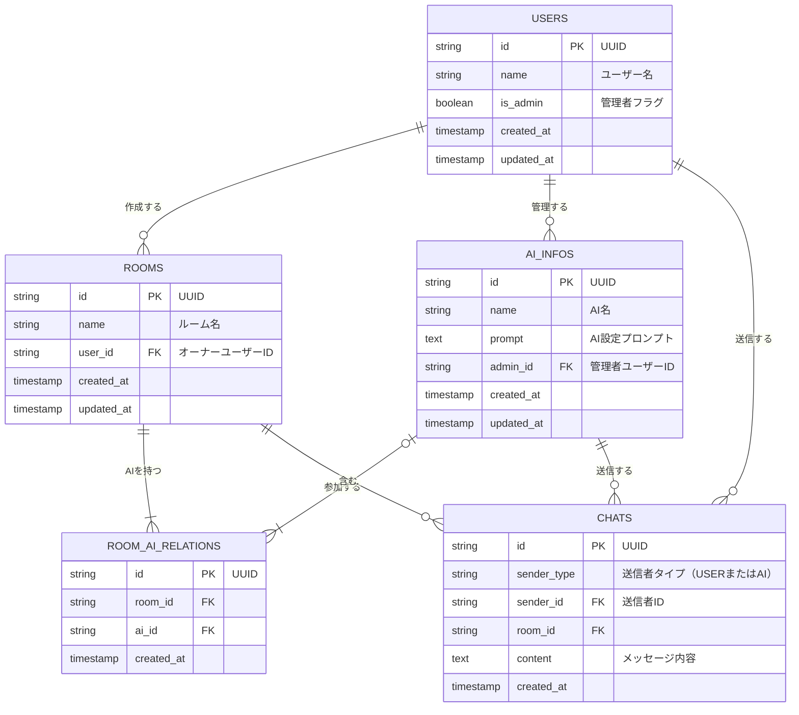

# AIのとも

## このリポジトリについて
[Spajam2024 第4回九州予選](https://spajam.jp/)にてチーム「Nova5」が企画・開発したアプリケーション「AIのとも」のソースコードを公開するリポジトリです。

ハッカソンの開発テーマは「とも」

開発時にコミット履歴やコードの一部にAPIキーが含まれたため念の為新規リポジトリでの公開としています。

## アプリケーション概要

テーマの「とも」を「友達」の「友」と解釈し企画を考案しました。

現実で友人関係を気づくのが苦手な人・SNS疲れになってしまった人・社会人になり友人と疎遠になった人。そのような方に、今までにない、**新しい形の友達**を提案するアプリです。

特徴は大きく２つで
1. 複数のAIとだけ会話をすることができる
2. AIの性格や特徴を自分で設定することができる

です。

## 資料

[当日発表スライド](https://drive.google.com/file/d/1j7q1XPtnWSwX1kKWIUGfTk2wkzQ2UUOJ/view?usp=sharing)

このスライドの作成は[irusiru](https://irusiru.jp/)を利用して作成した雛形を加筆修正したものです。

一部素材には[canva](https://www.canva.com/)と[unDraw](https://undraw.co/)を利用しています。

## 技術構成
- flutter
- supabase : DB, 認証, 画像ストレージとして使用
- openAI API : AIの返答生成に使用

## 機能
- AIとのグループチャット
- AIの作成と管理画面
- 自動翻訳を用いた多言語対応
- ダークモード対応

## ER図

