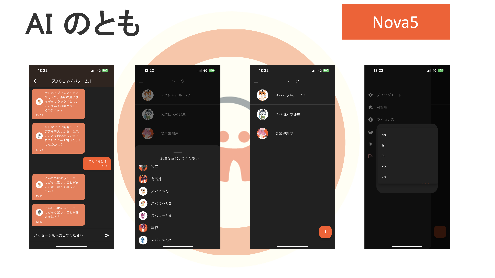

# AIのとも

## このリポジトリについて
[Spajam2024 第4回九州予選](https://spajam.jp/)にてチーム「Nova5」が企画・開発したアプリケーション「AIのとも」のソースコードを公開するリポジトリです。

開発時にコミット履歴やコードの一部にAPIキーが含まれたため念の為新規リポジトリでの公開としています。

## アプリケーション概要

## 資料

[当日発表スライド](https://drive.google.com/file/d/1j7q1XPtnWSwX1kKWIUGfTk2wkzQ2UUOJ/view?usp=sharing)

このスライドの作成は[irusiru](https://irusiru.jp/)を利用して作成した雛形を加筆修正したものです。

一部素材には[canva](https://www.canva.com/)と[unDraw](https://undraw.co/)を利用しています。

## 技術構成

